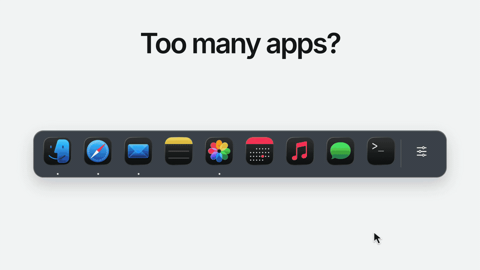
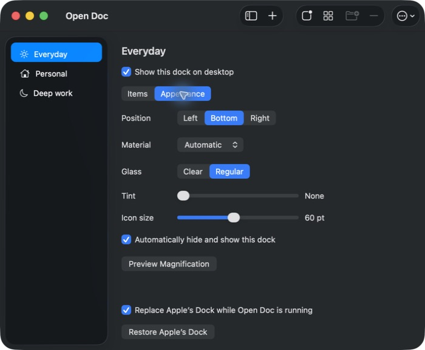
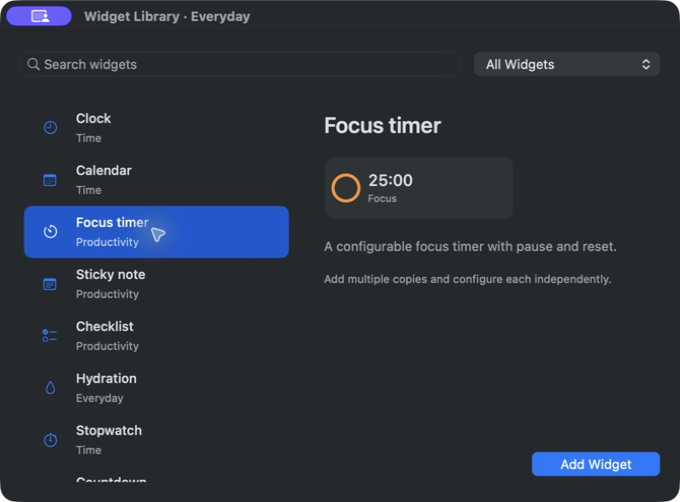

<p align="center">
  
</p>

<h1 align="center">Open Doc</h1>

<p align="center">
  <strong>A dock of your own.</strong><br>
  Group your apps, add widgets, and keep separate docks for work and everything else.
</p>

<p align="center">
  <a href="https://github.com/Ffinnis/opendoc/releases/latest"><strong>Download for Mac</strong></a>
  &nbsp;·&nbsp; <a href="https://ffinnis.github.io/opendoc/">Website</a>
  &nbsp;·&nbsp; <a href="#demo">Demo</a>
  &nbsp;·&nbsp; <a href="docs/Using-Open-Doc.md">User guide</a>
  &nbsp;·&nbsp; <a href="docs/Widgets.md">Widgets</a>
  &nbsp;·&nbsp; <a href="Examples/Agent-CLI.md">Agent CLI</a>
</p>

<p align="center">Free and open source · macOS 14+ · Apple silicon &amp; Intel</p>

## Demo

[](docs/assets/opendoc-demo.mp4)

**[Watch the full 39-second demo with sound](docs/assets/opendoc-demo.mp4)** · Folders, separate docks, a focus timer, agent-created widgets, and auto-hide.

<sub>The demo combines native captures with animated UI demonstrations. The agent conversation is staged. [Media details and credits](docs/assets/README.md).</sub>

## Make room for what you use

- **Group apps into folders.** Drag related apps together. Running-app dots show what's open inside each folder.
- **Keep more than one dock.** Give work, personal projects, or creative tools their own apps, position, and appearance.
- **Put widgets beside your apps.** Add clocks, focus timers, notes, checklists, system stats, or a custom widget with buttons and saved state.
- **Make it fit your screen.** Choose the bottom, left, or right edge, change icon size and tint, and enable auto-hide. Liquid Glass on macOS 26; native blur on earlier versions.
- **Configure it with your agent.** The `opendoc` CLI lets an agent inspect your setup, validate changes, and update widgets and dock settings.
- **Undo and back up your setup.** Undo dock edits in Settings, export your docks, and import them on another Mac.

### Inside the app

<details>
<summary><strong>Appearance: position, glass, tint, and auto-hide</strong></summary>

<p></p>

</details>

<details>
<summary><strong>Widget Library: browse, preview, and add widgets</strong></summary>

<p></p>

</details>

## Install

1. Download the **OpenDoc ZIP** from the [latest release](https://github.com/Ffinnis/opendoc/releases/latest).
2. Unzip it, move the app to `/Applications` or `~/Applications`, and launch it.
3. Point at the dock and click the settings button at its end to add apps, folders, or widgets. You can also Control-click the dock's background.

Requires **macOS 14 or later**. The same release runs on Apple silicon and Intel Macs. To build it yourself, see [Contributing](CONTRIBUTING.md#build-from-source).

**Your first launch:** Open Doc imports your pinned apps, shows running apps, and hides Apple's Dock. Quit Open Doc or choose **Restore Apple's Dock** from its menu bar menu to bring it back. Your original shortcuts stay unchanged.

## Ask your agent

With Open Doc running, ask a terminal-capable agent:

> Add a water tracker to my Work dock. Daily goal: 8 glasses.

Launching Open Doc from Applications installs the CLI. Open a new terminal and let the agent discover the available commands:

```sh
opendoc help
opendoc state
opendoc schema
opendoc help widget.add
```

The CLI supports widgets and dock settings. Create docks and organize application folders in the app. Follow the [agent guide](Examples/Agent-CLI.md) for a complete interactive widget example, or try the [USD/RUB widget](Examples/USD-RUB.md).

## A few things to know

<details>
<summary>Where does my data go?</summary>

Your configuration stays on your Mac. There are no analytics. Network access is used for updates, web widgets you configure, and links you open. Widget settings are plain JSON, so avoid putting secrets in URLs. Use **Export Backup...** in Settings to save your setup.

</details>

<details>
<summary>How do updates work?</summary>

Installed copies check daily through Sparkle. Choose **Check for Updates...** in the app menu to check manually, or turn automatic checks off. Downloads come from GitHub Releases; only published, verified releases reach the update feed.

</details>

<details>
<summary>What are the current limits?</summary>

Open Doc is still in development. It does not reserve desktop space, arrange other apps' windows, or provide window previews. It cannot embed Apple's desktop widgets. Webpage widgets read returned HTML, without your browser login or values loaded by a site's JavaScript. See the [widget guide](docs/Widgets.md) for supported sources and script limits.

</details>

## Contribute

Bug reports, UI improvements, and documentation fixes are welcome. [Open an issue](https://github.com/Ffinnis/opendoc/issues) or read [Contributing](CONTRIBUTING.md) for setup and isolated testing. Coding agents should also read [AGENTS.md](AGENTS.md). Release maintainers can use the [publishing guide](docs/Releasing.md).

## License

Open Doc is [MIT licensed](LICENSE). Inspired by [Dockset's public screenshots](https://dockset.app/); no Dockset code or assets are included. App icons belong to their respective owners. Demo media has separate [credits](docs/assets/README.md).
